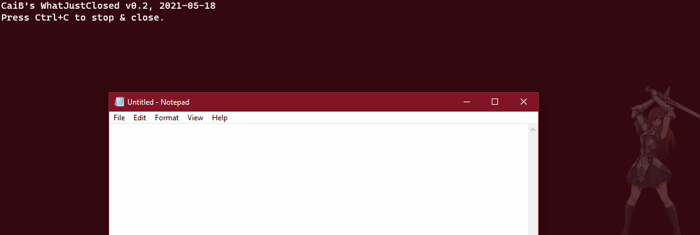

# WhatJustClosed

Using the Win32 API, adds a hook to be notified of all closing windows, and outputs information about each onto the console while running. Initially created to figure out what a radpidly appearing and disappearing window was. Tracking by process creation didn't lead to good results, because processes can open and close windows at will, hence this actually looks at windows closing.

A 64-bit compiled version can only detect windows closing of 64-bit programs, and vice versa for 32-bit.

Supply any command line argument (just the presence thereof is checked) to enable "all output" mode, where even windows that were not visible at the time of being closed will be shown.

Precompiled binaries for both 32-bit and 64-bit can be found in the ZIP file in the root of this repository.

